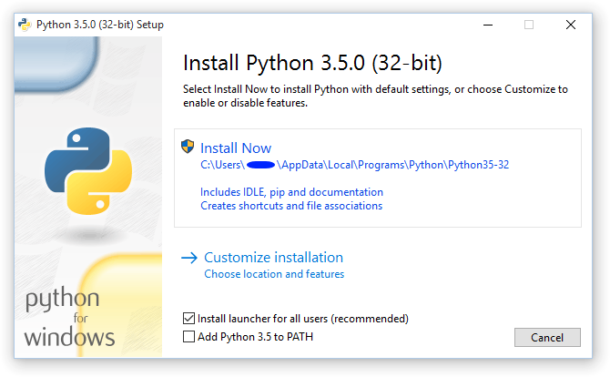

# Basic Html and Javascript

## Introduction

This is a mini tutorial on using HTML and Javascript to build a website and run it locally using Python 3.

In this tutorial you will learn how to create a basic web page and run it locally using python as a web server.  This will get you used to the editor and running a local web server.  It is not an in depth  HTML, CSS and Javascript tutorial.

We will quickly cover some common tags and styling them.  You will also get to write some javascript and use css.  

The tutorial will be using the command line to create a folder and open an editor.  Some experience of using terminal will be handy, but not essential.

## Set Up

This tutorial uses Python 3 as a web server and VS Code as an editor.

1. To install VSCode, go to https://code.visualstudio.com/ and click on the download button.  You can then install vscode onto your computer.

2. To install Python, go to http://dojo.soy/py-setup and click on the Download Python 3 button. There will be some other numbers after the 3, but they change too often for me to include them. Don't worry about them. Once the installer has downloaded, start it and click through it, accepting the default choices.  

```Important:  We need to make sure that python can be run from the command line.  On Windows ensure that 'Add Python to Path' is checked.```



python_win_installer.png

3. Terminal.  We are going to use a command line to create directories and run python commands.  On Windows I recommend using powershell, on Mac and Linux OS you can use the terminal.

## Steps

### Step 1 - Create a page

In this step we will create a simple html page and start the python web server

1.  Open your terminal and browse to a directory that you will use to put your source files.  Create a new directory using the following command.

```
mkdir basic-site
```

2. In the terminal window open this directory in your editor. 

```
code basic-site
```

3. Create new new file in this folder and name it index.html.  Add the following html to the file and save it.

```
<html>
<body>
    <h1>Hello DoJo</h1>
</body>
</html>
```

4. In the terminal change to the directory we created above using the command

```cd basic-site```  

5. In the terminal run the following command to start the python web server.

```
python3 -m http.server
```

Depending how python was installed you may need to run ```python``` and not ```python3```.

6. Open a browser (Chrome, IE, Firefox, Edge) and enter the following into the address bar.

http://localhost:8000

You should get to see the web page you created.

### Step 2 - Add some more tags

 Next we will experiment with some more tags.

 1.  Go back to the editor and add the following below the ```<h1>Hello DoJo</h1>```

 ```
    <p>This is a paragraph</p>
    <p>This is another paragraph below the first one.  Cool really</p>
    <ul>
        <li>This is</li>
        <li>a list</li>
        <li>of items</li>
    </ul>
    <a href="https://www.coderdojo.com">This is a link</a>
    <br/>
    <br/> The br tag added
    <br/> a break between the lines
 ```

 2.  Save the file and reload the page in the browser.  You should see an updated page.  If not, check that you saved the file and the html matches the following

 ```
 <html>

<body>
    <h1>Hello World</h1>
    <p>This is a paragraph</p>
    <p>This is another paragraph below the first one.  Cool really</p>
    <ul>
        <li>This is</li>
        <li>a list</li>
        <li>of items</li>
    </ul>
    <a href="https://www.coderdojo.com">This is a link</a>
    <br/>
    <br/> The br tag added
    <br/> a break between the lines
</body>

</html>
```
 
 ### Step 3 - Page Title

 Take a look in the browser at the tab showing our site.  It probably says something like ```localhost:8000```.  Lets fix that

 1.  Back in the editor add the following after the `<html>` tag.

 ```
 <head>
    <title>My First Page</title>
</head>
 ```

 2. Save the file and reload the browser.  The tab should change to display the text between the ```<title>``` tags.

 If not, check your code against the following.

 ```
<html>

<head>
    <title>My First Page</title>
</head>

<body>
    <h1>Hello World</h1>
    <p>This is a paragraph</p>
    <p>This is another paragraph below the first one.  Cool really</p>
    <ul>
        <li>This is</li>
        <li>a list</li>
        <li>of items</li>
    </ul>
    <a href="https://www.coderdojo.com">This is a link</a>
    <a href="https://www.phaser.io">This is a link to the phaser site</a>
    <br/>
    <br/> The br tag added
    <br/> a break between the lines
</body>

</html>
```

 ### Step 4 - Lets add some color

 Out page is kind of dull looking, lets use styles to change it. 

 We can change the look of our content using styles.  First we will use inline styles and in the next step we will look at using Cascading Style Sheets or CSS for short.

 1.  Back in editor find the ```<body>``` tag.  We are going to update this change the background colour. Edit it as follows.

 ```
 <body style="background:yellow;">
 ```

2. Save and reload.  The page should now be yellow.

3. Lets change the font color of the ```h1``` tag.

 ```
 <h1 style="color:LimeGreen;">Hello World</h1>
 ```
4. Save and reload.  The title should now be a lovely green.

### Step 5 - I'm lazy, lets do this once.

As you can see we can edit the HTML and apply styles to the tags that change the look.  Lets imagine now we want to update the anchor ```<a>``` tags to have a new style.

Right now our page only has 2 tags, but imagine if we had lots more, 100s for example on multiple pages.  Updating each tag like this would be lots of work.  We can use CSS to define a style that gets used by all the tags on the page and across the site.

1. Create a new file and call it ```styles.css```.  Save it in the same directory as the ```index.html``` file.
2. Add the following to the ```styles.css``` file and save it.

```
a {
    font-size: 1.75rem;
    color: red;
}
```
3. Go to the ```index.html``` file and add the following into the head section and save it.

```
    <link rel="stylesheet" type="text/css" href="./styles.css">
```

It should look like this.

```
<head>
    <title>My First Page</title>
    <link rel="stylesheet" type="text/css" href="./styles.css">
</head>

```
4. Reload the page.  You should see the links have become larger and red.

### Step 6 - Scripts

Lets move on to some javascript.  So what is it.  JavaScript is a programming language used to make webpages interactive.  It can also be run on servers, but not what we are going to look at.

Lets add a button to the page, that when pressed displays the date and time.


1.  In the body section add a button tag as shown below.

```
<button type="button">Click me to display Date and Time.</button>
```

2. Below the button tag and a paragraph tag.  This is the tag we will update when the button is clicked.  We have given the tag an id that we can use to find it in javascript.

```
<p id="demo"></p>
```

3. Save the page and reload it in the browser.  You should see a button.  Try clicking it ... nothing happens.  We need to add the javascript code to do something.  

4. We are going to add a event handler.  Update the button tag as shown below.

```
<button type="button"
onclick="document.getElementById('demo').innerHTML = Date()">
Click me to display Date and Time.</button>
```

When the button is clicked, it runs the following Javascript.  This gets our paragraph tag with the id equal to demo and sets the inner html to the result of calling the Date() function

```
document.getElementById('demo').innerHTML = Date()
```

